# Distributed Vector Database Engine

A production-grade, memory-efficient **distributed vector database**, built from scratch in **C++**, with a custom **HNSW** index, a **gRPC** API layer, and a **React** monitoring dashboard.

This is the same category of system as Pinecone, Weaviate, and Milvus — but every layer is hand-built here: the index, the distance math, the sharding, the durability, and the storage engine.



---


## 1. What Is This Project?

A **vector database** is a system that stores lists of numbers (called **vectors** or **embeddings**) and can very quickly answer the question: *"which of these millions of vectors is most similar to this new vector?"*

This matters because modern AI doesn't work with words directly — it works with vectors. Every document, image, or piece of text gets converted into a vector by a machine learning model, in such a way that *similar things end up as vectors that are close together in space*. A vector database is the engine that stores those vectors and finds the closest ones, fast.

This project implements the entire stack needed to do that at scale:

- A **C++ HNSW index** — the core algorithm that makes "find the closest vector" fast even with millions of vectors.
- A **distributed shard architecture** — splitting the data across multiple machines using consistent hashing.
- A **Write-Ahead Log (WAL)** — so no data is lost if the server crashes.
- A **gRPC/Protobuf API** — a fast, strongly-typed way for clients to talk to the server.
- A **memory-mapped storage layer** — so reading data from disk is nearly free.
- A **React + WebSocket dashboard** — a live view into what the system is doing.
- **SIMD-accelerated distance math** — using special CPU instructions to compare vectors extremely fast.

### What makes this "advanced"

A normal CRUD app stores rows and looks them up by an exact key (like a user ID). This system is fundamentally different: it stores **points in high-dimensional space** (often 768 to 4096 numbers per vector) and has to answer *"what's nearby?"* — a geometry problem, not a lookup problem. That means:

- **Custom data structures**: a graph (HNSW), not a B-tree.
- **Custom math**: SIMD-accelerated distance functions, not SQL `WHERE` clauses.
- **Custom distribution logic**: geometry-aware sharding, not simple key-based partitioning.

Combining that with manual memory management in C++ makes this a genuine systems-programming project that touches algorithms, distributed systems, and ML infrastructure all at once.

---

## 2. Why Does This Exist? (Use Cases)

Every AI feature that finds "things like this" is secretly running a vector search underneath. In plain terms:

| Use Case | In Simple Words |
|---|---|
| **Semantic document search** | Turn documents into vectors, turn the search query into a vector too, then find the documents whose vectors are closest to the query's vector. |
| **Image similarity** | Turn images into vectors using a model like CLIP, then find visually similar images. |
| **RAG pipelines (for LLMs)** | Before asking an LLM a question, first fetch the most relevant pieces of text (via vector search) and feed them in as context. |
| **Recommendation engines** | Represent users and items as vectors; recommend items whose vectors are close to the user's. |
| **Anomaly detection** | Flag vectors that sit far away from every known cluster — they're "different" from everything else. |
| **Duplicate detection** | Find near-identical content by checking which vectors are almost on top of each other. |

---

## 3. Why C++?

A vector database is extremely performance-sensitive, and C++ is chosen here for four concrete reasons:

- **Manual memory control** — custom allocators and arenas avoid the unpredictable pauses that come with garbage-collected languages.
- **SIMD intrinsics** — direct access to CPU vector instructions (AVX2/AVX-512) to compare many numbers per instruction instead of one at a time.
- **Predictable latency** — no garbage collector pauses, no JIT warm-up. Every query has consistent, low, sub-millisecond tail latency.
- **Cache efficiency** — data layout can be hand-arranged so the CPU's cache is used as effectively as possible.

---

## 4. The Big Picture — How a Request Flows Through the System

At the highest level, there are only three operations that matter: **insert**, **search**, and **delete**. Here's the simplified path for each of the two big ones.

### Insert, in plain words

1. The client sends a vector over gRPC.
2. The API Gateway checks the request is authenticated and decodes it.
3. The Coordinator figures out which shard "owns" this vector (via consistent hashing).
4. That shard writes the vector to its Write-Ahead Log first — **durability before anything else**.
5. The shard then inserts the vector into its HNSW graph index.
6. A node ID is returned to the client.

### Search, in plain words

1. The client sends a query vector and asks for the top K nearest matches.
2. The Coordinator sends this query to **every shard at once**, in parallel.
3. Each shard searches its own local HNSW graph and returns its own local top-K.
4. The Coordinator merges all the partial results together and keeps only the true global top-K.
5. That final list is sent back to the client.

### How HNSW graph traversal actually works

HNSW (Hierarchical Navigable Small World) is a **multi-layer graph**. Think of it like a road network:

- The **top layers** are sparse, long "highways" — they let you jump across large distances in the vector space quickly.
- The **bottom layer (layer 0)** is a dense local street network — this is where the actual precise neighbours live.

The traversal works like this:

1. Start at one single global entry point, at the very top layer.
2. Greedily walk to whichever neighbour is closer to the query than the current node.
3. When no neighbour is closer (a "local minimum"), drop down one layer at the same node and repeat.
4. Keep dropping down layer by layer until you reach layer 0.
5. At layer 0, do a wider "beam search" — keep a small pool of the best candidates seen so far (`ef_search` of them) instead of just one.
6. Return the top-K closest vectors from that final candidate pool.

This gives roughly **O(log N)** search time — dramatically faster than checking every single vector one by one (`O(N)`), which is what a naive/brute-force search would require.

---

## 5. Core Concepts You Need to Understand First

### 5.1 Vectors and Embeddings

A **vector** here is simply a fixed-length list of decimal numbers (32-bit floats). The length ("dimension") is set per collection — common sizes are 384, 768, 1536, or 3072, matching the output size of popular embedding models.

An **embedding** is a vector produced by a neural network such that semantically similar inputs end up geometrically close together. Two articles about the same topic will have embeddings that sit near each other in space.

### 5.2 Approximate Nearest Neighbour (ANN) search

Checking every single vector to find the closest one (**exact search**) takes time proportional to `N × dimension` — completely impractical once you have millions of vectors. **ANN algorithms** trade a tiny, controllable amount of accuracy for a massive speedup. HNSW typically achieves **95–99% recall at 10–100x the speed** of brute-force search.

### 5.3 HNSW parameters, explained simply

- **M** — how many neighbours each node keeps links to. Higher M = better accuracy, but more memory and slower inserts.
- **ef_construction** — how wide a search to do while *building* the graph. Higher = better graph quality, slower to build.
- **ef_search** — how wide a search to do while *querying*. Higher = better accuracy, slower per-query.

### 5.4 Consistent Hashing

Instead of splitting vectors across shards with a simple rule like `id % shard_count` (which would force a full reshuffle every time a shard is added or removed), this system uses a **consistent hash ring**. Each shard owns a range of the hash space. Adding or removing a shard only moves a small fraction of the data — not everything.

### 5.5 Write-Ahead Log (WAL)

Before a vector ever touches the HNSW graph, it is first written to an append-only log file. If the process crashes right after that write, the log can be **replayed** on restart to rebuild exactly the state that was lost — without needing to constantly save the entire index to disk on every single insert.

### 5.6 Memory-Mapped Storage

Raw vector data lives in files that are **memory-mapped** (`mmap`) rather than read normally. This means:

- The operating system's own page cache automatically keeps "hot" (frequently used) vectors in RAM and quietly moves "cold" ones out — no custom caching logic needed.
- Reading a vector is a **zero-copy** operation: the CPU reads straight from the mapped memory address, with no extra buffer copy and no `read()` system call.

---

## 6. System Architecture

```

```
### Deployment topology, in plain words

Each shard runs in its own Docker container, and the Coordinator runs as a separate container from the shards. In a real production deployment, shards typically live on separate physical machines so their memory pools stay isolated from each other. A minimum working deployment is **1 coordinator + 3 shards**. Shards scale out horizontally, and the coordinator handles rebalancing the hash ring when that happens.

---

## 7. Module-by-Module Breakdown

### 7.1 gRPC API Gateway (`src/server/`)

**What it does:** This is the single front door for all outside traffic. It handles TLS (encryption), checks API keys, applies rate limiting (a token bucket per client), decodes incoming protobuf messages, and does basic validation — all before anything reaches the Coordinator.

**Key pieces:**
- `VectorDBServiceImpl` — implements the gRPC service methods generated from `vecdb.proto`.
- `AuthMiddleware` — checks bearer tokens against an in-memory store (can later be swapped for Redis).
- `RateLimiter` — a per-client token bucket that refills at a configurable rate.

**Why it's kept separate from the Coordinator:** The API layer holds no state of its own, so it can be scaled out independently under heavy read traffic. The Coordinator, on the other hand, holds important routing state (the hash ring), so it's kept as its own layer.

**Threading model:** gRPC spins up one thread per CPU core for its completion queue. Regular requests run directly on these threads. Long, bulk operations (like bulk insert) use async streaming instead of blocking a thread.

---

### 7.2 Query Coordinator (`src/shard/`)

**What it does:** This is effectively the brain of the whole distributed system. It owns the consistent hash ring and always knows exactly which shard is responsible for which vector IDs. For an insert, it routes to exactly one shard. For a search, it fans the request out to *every* shard and merges the results.

**Key pieces:**
- `ShardManager` — the top-level orchestrator; this is what the gRPC layer calls into.
- `ConsistentHashRing` — maps a `vector_id` to a `shard_index` using a sorted ring of virtual nodes.
- `ScatterGather` — fires off concurrent requests to every shard using `std::async`, then collects and merges the results.

**How the merge actually works:** If a client asks for `top_k = 10` across 3 shards, each shard returns its own top-10, giving the Coordinator 30 candidate results. It runs a partial sort over those 30 to extract the true global top-10. This step is cheap compared to the actual HNSW search happening inside each shard.

**Failure handling:** If a shard doesn't respond in time, the Coordinator still returns whatever results it has, along with a `degraded` flag, rather than failing the whole request. A circuit breaker also tracks which shards keep failing and temporarily stops sending them traffic until they pass a health check again.

---

### 7.3 HNSW Index (`src/hnsw/`)

**What it does:** This is the actual core data structure of the whole project. Every shard owns exactly one `HNSWIndex`. It stores the vectors themselves along with the graph connections between them, and it's what implements both insert and nearest-neighbour search.

**How data is laid out in memory:**
- `vectors_[]` — one flat array of floats; vector `i` lives starting at `vectors_[i * dim]`, aligned to 64 bytes so the CPU cache is used efficiently.
- `NeighbourStore` — uses a `pmr::monotonic_buffer_resource` arena (explained more in the memory section below) so that adding graph connections never causes memory fragmentation.
- `entry_point_` — the current global starting node for searches (kept atomic since it can be updated concurrently).
- `max_layer_` — the current highest occupied layer in the graph.

**Insert, step by step:**
1. Randomly decide which layer this new node should exist at (higher layers are rarer, by design).
2. Lock the index for writing.
3. From the top layer down to just above the chosen layer, do a cheap greedy search just to find the closest entry point.
4. From the chosen layer down to layer 0, do a proper wide search, pick the best neighbours, and connect the new node to them in both directions — pruning any neighbour lists that now have too many connections.
5. If this node's layer is higher than anything seen before, it becomes the new global entry point.

**Search, step by step:**
1. Start at the current entry point, at the top layer.
2. Greedily descend layer by layer using a narrow search (just enough to find the closest node at each layer).
3. At layer 0, do a wider beam search — keep a small heap of the best candidates and keep expanding the closest unexplored one.
4. Return the top-K vectors from that final candidate heap.

**Thread safety:** Each index uses a `std::shared_mutex`. Multiple searches can run **at the same time** because they only need a shared (read) lock. Inserts need an exclusive lock. Since reads are the hot path and far more frequent than writes, this keeps searches fast under normal traffic.

---

### 7.4 SIMD Distance Kernels (`src/simd/`)

**What it does:** Computes how "far apart" two vectors are (L2/Euclidean distance, or cosine distance) as fast as the CPU physically allows.

**How AVX2 speeds this up:** Instead of comparing one number at a time, AVX2 processes 8 floats per CPU instruction using 256-bit registers, and uses fused multiply-add instructions to compute and accumulate squared differences in a single step. A final "horizontal reduction" step collapses those 8 parallel lanes down into one final number.

**Why squared distance instead of true distance:** Computing a true Euclidean distance requires a square root, which is relatively expensive — and unnecessary for *comparisons*. If one squared distance is smaller than another, the true distance is smaller too. So internally, the system compares squared distances the whole time and only converts to a true distance right before sending the final answer back to the client.

**Runtime CPU detection:** On startup, the system checks what instruction sets the actual CPU supports (via CPUID) and picks the best one available, in this order: AVX-512 → AVX2 → SSE4.2 → plain scalar fallback. That choice is made once, at startup, so there's no extra branching overhead during actual queries.

---

### 7.5 Write-Ahead Log (`src/wal/`)

**What it does:** Guarantees that an inserted vector is never silently lost, even if the process crashes between accepting the insert and fully updating the index.

**File format (per entry):** a log sequence number, the vector's ID, its dimension, a checksum, and then the raw float data for the vector itself.

**Writing:** The log file is memory-mapped, so writes go straight into mapped memory with no `write()` system call. The operating system flushes this to disk on its own schedule. Periodically (every N writes or T seconds), an `msync` call forces a guaranteed flush to disk, and the "checkpoint" position is advanced.

**Replaying after a crash:** On startup, the log is scanned forward from the last checkpoint. Each entry's checksum is verified; if it's valid, that vector gets re-inserted into the index. If a checksum is invalid (meaning the write was interrupted mid-way by the crash), replay simply stops there — that entry, and anything after it, wasn't safely acknowledged anyway.

**Log compaction:** Once a full snapshot of the index has been safely written to storage, the log can be trimmed back to just that snapshot point, which keeps it from growing forever.

---

### 7.6 Memory-Mapped Storage (`src/storage/`)

**What it does:** Persists the raw vector data and index metadata to disk without the usual overhead of serializing and deserializing data.

**Segment format:** The flat vector array is memory-mapped directly to a disk file: a small fixed-size header (version, dimension, vector count, checksum) followed immediately by the raw float data. Because the in-memory layout and the on-disk layout are identical, *saving* is just an `msync()` call and *loading* is just an `mmap()` call — both are essentially instant from the CPU's perspective, since the operating system handles the actual disk paging lazily in the background.

**Metadata file:** The HNSW graph's adjacency lists (which node connects to which) can't be memory-mapped directly, since they involve pointers rather than flat data. So this part is serialized separately into a JSON or MessagePack file, and rebuilt into a fresh in-memory arena when the shard starts up.

**Hot/cold tiering:** There's no custom caching logic needed here at all — frequently accessed segments simply stay resident in the operating system's page cache, and cold, rarely-used segments get quietly evicted by the OS's own memory management. The kernel does this work for free.

---

### 7.7 Thread Pool (`src/util/`)

**What it does:** Provides a bounded, reusable set of worker threads for background shard operations — compaction, flushing the WAL, collecting metrics, and so on.

**How it's implemented:** A fixed-size pool of `std::jthread` workers that pull tasks from a queue, protected by a mutex and a condition variable. Submitting a task returns a `std::future` so the result can be collected later. By default, the number of threads matches the number of CPU cores available.

**Why not just spin up threads on demand:** Using `std::async` with a new OS thread for every single task works fine at low volume, but under a burst of thousands of inserts per second, constantly creating and destroying threads adds real overhead and puts pressure on the OS scheduler. A fixed pool spreads that cost out and reuses threads instead.

---

## 8. Step-by-Step Request Walkthroughs

### 8.1 Startup sequence

1. `main.cpp` reads `config.toml`.
2. The thread pool is initialized with N worker threads.
3. For each shard: its WAL is opened and replayed from the last checkpoint into a fresh HNSW index; its segment files are memory-mapped to populate the raw vector array; and its adjacency metadata is deserialized from JSON into the neighbour store.
4. The consistent hash ring is populated with all shard endpoints.
5. The gRPC server binds to its port and starts its completion queue threads.
6. The metrics HTTP endpoint (for Prometheus) comes up.
7. The WebSocket server starts, ready to feed the React dashboard.
8. The system is now ready to accept requests.

### 8.2 Insert request, step by step

1. Client calls `Insert(collection, vector_bytes, metadata)`.
2. gRPC decodes the protobuf message; `AuthMiddleware` checks the bearer token.
3. `RateLimiter` checks the client's quota, rejecting the request if it's been exceeded.
4. The Coordinator receives the parsed insert request.
5. The consistent hash ring determines which shard owns this vector's ID.
6. The `ShardManager` takes an exclusive lock on that shard.
7. The vector is appended to that shard's WAL first.
8. If the checkpoint threshold has been reached, an `msync` is triggered.
9. The vector is inserted into that shard's HNSW index (layer sampling, greedy descent, neighbour connection — as described in section 7.3).
10. The lock is released.
11. A response containing the new node ID and latency is returned to the client.

### 8.3 Search request, step by step

1. Client calls `Search(collection, query_bytes, top_k, ef_search)`.
2. gRPC decodes the request; auth and rate limiting checks run.
3. The Coordinator receives the parsed query.
4. The query is fanned out to all shards concurrently via `std::async`.
5. Each shard runs its own HNSW search independently, under a *shared* (read) lock so multiple searches can run at once.
6. The Coordinator collects each shard's local top-K results.
7. A partial sort extracts the true global top-K across all shards' results.
8. Metadata for each result is fetched from storage.
9. The final response (results, latency, and a `degraded` flag if any shard was unavailable) is built.
10. gRPC serializes the response and sends it back to the client.

### 8.4 Crash recovery flow

1. The process crashes mid-insert — after the WAL write succeeded, but before the HNSW index finished updating.
2. The process restarts.
3. The WAL is replayed from the last checkpoint: each entry's checksum is verified, and valid entries are re-inserted into a fresh HNSW index. Replay stops the moment an invalid (torn) entry is found.
4. The index is now consistent with the last durable WAL entry.
5. Any insert that was in-flight but never made it into the WAL is considered lost — and the client would never have received a success acknowledgment for it anyway.

### 8.5 Metrics and monitoring flow

1. Every RPC handler records its latency, result count, and error code.
2. The metrics module aggregates these into latency histograms (P50/P95/P99).
3. Prometheus scrapes the `/metrics` HTTP endpoint every 15 seconds.
4. A WebSocket server separately pushes live per-shard metrics to the React dashboard roughly once per second — vector counts, insert/search throughput, P99 latency, WAL lag, and memory usage.
5. The React dashboard renders all of this as live charts.

---

## 9. Memory Efficiency Strategy

Supporting hundreds of millions of vectors requires being deliberate about memory from the ground up. This is one of the most technically important parts of the whole project.

### 9.1 Arena allocation for neighbour lists

Every single insert creates new graph connections (neighbour list entries). If each of those used the default allocator (plain `new`/`delete`), the heap would fragment badly over time under sustained inserts.

Instead, all neighbour lists are allocated from a `std::pmr::monotonic_buffer_resource` — essentially a slab allocator that just bumps a pointer forward for every new allocation and never frees individual items one at a time. The entire arena is freed all at once, only when the index itself is destroyed or snapshotted.

```cpp
// One 512MB arena for all neighbour lists in a shard
std::pmr::monotonic_buffer_resource pool(512ULL * 1024 * 1024);
std::pmr::vector<std::pmr::vector<NodeId>> adj(&pool);
```

This gives zero fragmentation, cache-friendly sequential addresses, allocation in constant time, and no lock contention on a shared global heap.

### 9.2 Cache-line aligned vector storage

Raw vectors are stored in one flat array, aligned to 64 bytes (a typical CPU cache line size). Vector `i` always starts at a predictable offset. This means comparing two vectors touches a contiguous block of memory, which plays perfectly with the CPU's automatic prefetching.

### 9.3 Zero-copy persistence

Vector data is never converted into some other format before being saved or loaded. The in-memory array is memory-mapped directly to and from disk — saving is just an `msync()`, loading is just an `mmap()`. No intermediate copying, no CPU time wasted converting formats.

### 9.4 Avoiding false sharing

Each graph node is aligned so it occupies its own cache line. Without this, two different CPU cores working on adjacent nodes during parallel searches could accidentally invalidate each other's cache lines even though they're touching completely unrelated data — a subtle performance bug called "false sharing."

### 9.5 Example memory budget (1M vectors, dimension 768, per shard)

| Component | Size |
|---|---|
| Raw vector data (1M × 768 × 4 bytes) | 3.07 GB |
| HNSW layer-0 neighbours (M=16) | 64 MB |
| HNSW upper layers (sparse) | ~8 MB |
| WAL (pre-checkpoint entries) | ~500 MB (bounded) |
| Metadata (JSON, ~100 bytes/record) | ~100 MB |
| **Total per shard** | **~3.75 GB** |

With 3 shards holding 3 million vectors total, the full deployment uses roughly **11 GB of RAM** — comfortably within a modern server's capacity.

---

## 10. Data Models

### 10.1 Collection

A collection groups together vectors that share the same dimension and configuration:

```json
{
  "name": "documents",
  "dim": 1536,
  "metric": "l2",
  "hnsw": {
    "M": 16,
    "ef_construction": 200,
    "ef_search": 50
  },
  "shard_count": 3,
  "created_at": "2025-01-01T00:00:00Z"
}
```

### 10.2 Vector record

```json
{
  "id": "doc_00123",
  "vector": [0.12, -0.34, 0.56, "..."],
  "metadata": {
    "source": "wikipedia",
    "title": "Transformer (machine learning)",
    "url": "https://...",
    "token_count": 412
  }
}
```

### 10.3 WAL entry (binary layout)

| Offset | Size | Field |
|---|---|---|
| 0 | 8 | LSN (uint64, little-endian) |
| 8 | 8 | vector_id hash (uint64) |
| 16 | 4 | dim (uint32) |
| 20 | 4 | CRC32 checksum of the data below |
| 24 | dim × 4 | float32 vector data (IEEE 754, little-endian) |

### 10.4 Segment file header (binary layout)

| Offset | Size | Field |
|---|---|---|
| 0 | 4 | magic (`0x56454344`, i.e. "VECD") |
| 4 | 2 | format version |
| 6 | 2 | flags |
| 8 | 8 | vector count |
| 16 | 4 | dim |
| 20 | 4 | header checksum |
| 24 | 8 | creation timestamp (Unix ns) |
| 32 | ... | padding to 64 bytes |
| 64 | ... | float32 vector data begins |

---

## 11. API Reference

All communication happens over **gRPC**, using **Protobuf** for message encoding.

### Insert
Insert a single vector into a collection.
```protobuf
rpc Insert(InsertRequest) returns (InsertResponse);

message InsertRequest {
  string collection = 1;
  string id = 2;        // client-provided stable ID
  bytes vector = 3;     // raw float32 LE bytes
  bytes metadata = 4;   // arbitrary JSON payload
}

message InsertResponse {
  uint64 node_id = 1;
  int64 latency_us = 2;
}
```

### Search
Find the K nearest neighbours to a query vector.
```protobuf
rpc Search(SearchRequest) returns (SearchResponse);

message SearchRequest {
  string collection = 1;
  bytes query = 2;
  int32 top_k = 3;
  int32 ef_search = 4;  // 0 = use collection default
}

message SearchResult {
  string id = 1;
  float distance = 2;
  bytes metadata = 3;
}

message SearchResponse {
  repeated SearchResult results = 1;
  int64 latency_us = 2;
  bool degraded = 3;    // true if a shard was unavailable
}
```

### BulkInsert (streaming)
```protobuf
rpc BulkInsert(stream InsertRequest) returns (BulkInsertResponse);

message BulkInsertResponse {
  uint64 inserted = 1;
  uint64 failed = 2;
  int64 latency_us = 3;
}
```

### Delete
```protobuf
rpc Delete(DeleteRequest) returns (DeleteResponse);

message DeleteRequest {
  string collection = 1;
  string id = 2;
}
```

### GetCollectionInfo
```protobuf
rpc GetCollectionInfo(InfoRequest) returns (InfoResponse);

message InfoResponse {
  string collection = 1;
  uint64 vector_count = 2;
  uint32 shard_count = 3;
  repeated ShardInfo shards = 4;
}

message ShardInfo {
  uint32 shard_id = 1;
  uint64 vector_count = 2;
  uint64 memory_bytes = 3;
  string status = 4;    // "healthy" | "degraded" | "offline"
}
```

---

## 12. Frontend Dashboard

The React dashboard connects to the server two ways: **WebSocket** for live metrics, and **gRPC-Web** for actual API interactions.

- **Overview page** — total vector count, global insert/search throughput, P50/P95/P99 latency chart, and shard health status cards.
- **Shard map page** — a visual grid of every shard showing vector count, memory usage, WAL lag, and last heartbeat. Clicking a shard opens a detail view with per-shard insert/search rates and layer distribution.
- **Search playground** — paste or upload a query vector, set `top_k` and `ef_search`, and see a results table with ID, distance, and metadata preview.
- **Index inspector** — enter a node ID to see its neighbours at every HNSW layer, visualised as a force-directed graph using D3.

### WebSocket message format

```json
{
  "type": "metrics",
  "ts": 1700000000000,
  "shards": [
    {
      "id": 0,
      "vector_count": 1234567,
      "insert_rate": 4200,
      "search_rate": 890,
      "p99_latency_us": 2340,
      "memory_mb": 3840,
      "wal_lag_bytes": 102400,
      "status": "healthy"
    }
  ]
}
```

---


## 13. Tech Stack Summary

| Layer | Technology |
|---|---|
| Core language | C++23 |
| ANN index | Custom HNSW implementation |
| Distance math | Hand-written AVX2 / AVX-512 SIMD kernels |
| API layer | gRPC + Protobuf |
| Durability | Custom Write-Ahead Log (mmap-backed) |
| Storage | Memory-mapped flat file segments |
| Sharding | Consistent hashing with virtual nodes |
| Concurrency | `std::shared_mutex`, `std::jthread` thread pool |
| Memory management | `std::pmr::monotonic_buffer_resource` arenas |
| Frontend | React + TypeScript + Vite |
| Live metrics | WebSocket + Prometheus |
| Deployment | Docker + Docker Compose |
| Build system | CMake + Conan |
| Testing | Google Test (unit/integration) + Google Benchmark |


---

Built with **C++23 · gRPC · Protobuf · AVX2 · React · Docker**